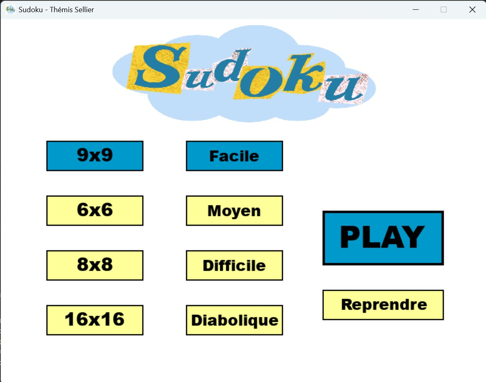
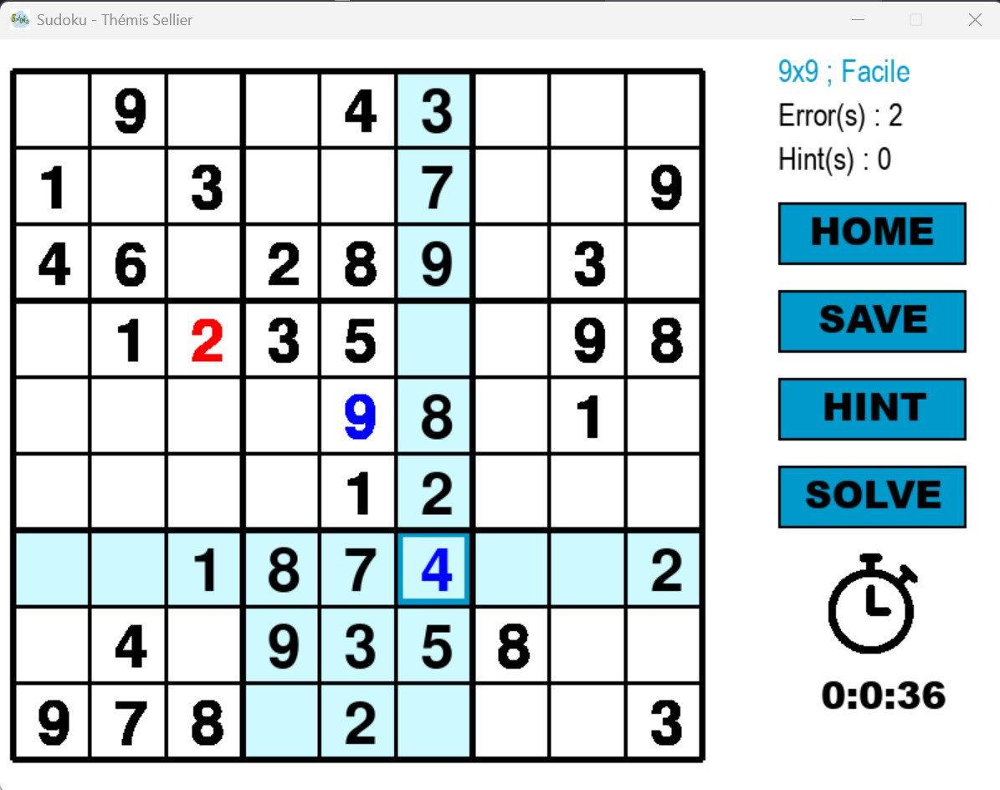

## 🧩 Sudoku Game (Python + Pygame)

This project is a Sudoku game built with Python using the Pygame library.

## 📸 Preview

  
  

## 🎮 Features

Generates a valid Sudoku grid using a backtracking algorithm.
Removes a number of cells based on the selected difficulty level.
Lets the player fill in the grid and solve the puzzle interactively.

Displays:
The number of hints used, the number of mistakes made, the player can move around the board using the arrow keys or by clicking on cells with the mouse to select them.

## 🧠 How It Works

The program first creates a fully solved Sudoku board using a recursive backtracking algorithm.
Depending on the chosen difficulty, it removes certain numbers to create the puzzle.
The player can then:
click on cells or use the arrow keys to move around, input numbers to fill the grid, request hints, track progress with error and hint counters.

## 🚀 Technologies

Python 3 and
Pygame
